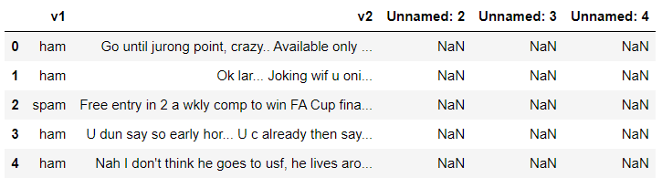
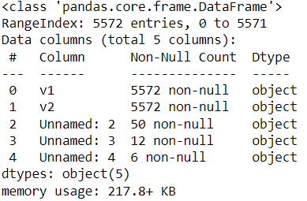
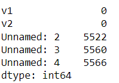
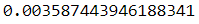

# Implementation-of-SVM-For-Spam-Mail-Detection

## AIM:
To write a program to implement the SVM For Spam Mail Detection.

## Equipments Required:
1. Hardware – PCs
2. Anaconda – Python 3.7 Installation / Jupyter notebook

## Algorithm
1. Read the csv file
2. Import necessary libraries 
3. Get the Prediction value and accuracy value
4. End the Program

## Program:


Program to implement the SVM For Spam Mail Detection..

Developed by: Sabari Akash A 

RegisterNumber:  212222230124
```py
import pandas as pd
data=pd.read_csv('/content/spam.csv',encoding='Windows-1252')

data.head()

data.info()

data.isnull().sum()

x=data["v1"].values
y=data["v2"].values

from sklearn.model_selection import train_test_split
x_train,x_test,y_train,y_test=train_test_split(x,y,test_size=0.2,random_state=0)

from sklearn.feature_extraction.text import CountVectorizer
cv=CountVectorizer()

x_train=cv.fit_transform(x_train)
x_test=cv.transform(x_test)

from sklearn.svm import SVC
svc=SVC()
svc.fit(x_train,y_train)
y_pred=svc.predict(x_test)
y_pred

from sklearn import metrics
accuracy=metrics.accuracy_score(y_test,y_pred)
accuracy
```

## Output:






## Result:
Thus the program to implement the SVM For Spam Mail Detection is written and verified using python programming.
